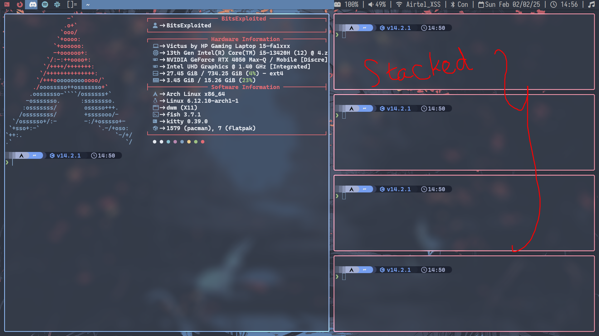
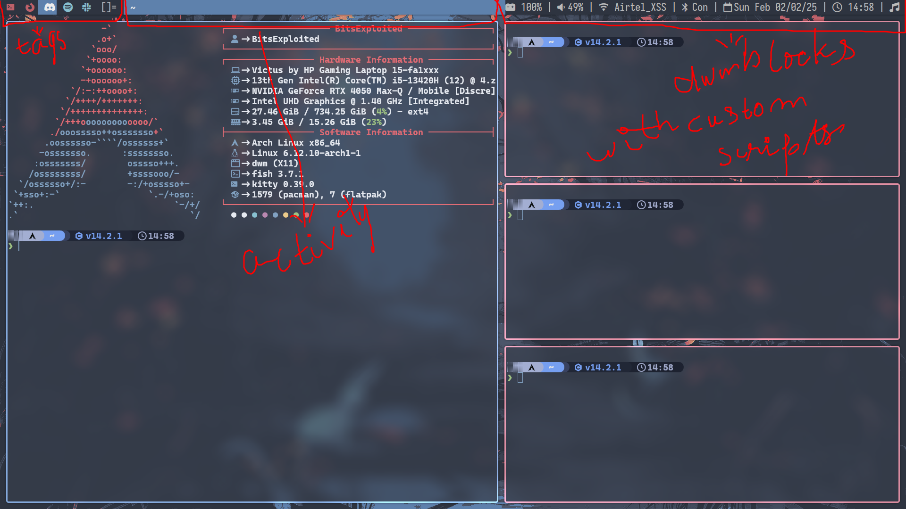

## Introduction

Welcome to this blog where I will be writing about **DWM (Dynamic Window Manager)** which is written in C intended to reduce bloat as much as possible giving us a smooth user experience. Configuring DWM can be hard for a few, but the end result is worth it. I recently wanted to try DWM for fun and turned out it was actually a very good experience that I have switched from Hyprland to DWM permanently.

To configure DWM we have to manually edit the C source code, after the changes we save. Compile it with the `make` command and then finally quit DWM and log back in for the changes. If there are any errors with the source code, then DWM won't allow you to log inside the DWM until the error is corrected. So, what I did is I would backup after every stable change I make and in case of there are any errors I would copy the backup file or manually edit them in a tty.

## About DWM

DWM is a window manager for X server made by **suckless.org** — a group of programmers working together to make software that "suck less". They have made many tools like:

- `st` (suckless terminal/simple terminal)
- `surf` (a web browser)
- and some other "core" programs for a suckless experience.

There are many layouts to manage windows like **tiled**, **monocle**, **floating layout**. We can switch between different layouts using keybinds dynamically according to the application that we are working with.

## How are windows managed

In **tiled mode**, the windows are stacked above one another as a new window is created every time. Stack in the sense not "literally" stack but the windows act stacked in the memory as in the data structure "stack".

In **monocle layout**, all the windows are fullscreen and now are literally stacked above each other when they are created.

In the **floating layout**, it is like what we use in rest of the desktop environments and in Windows. All the newly created windows are floating.

## Workspaces/Tags

In DWM, the workspaces are called **"tags"**. By default, there are 10 tags but we can change them to however many we want. We can also replace them with a logo instead of just numbers.

We can switch between them with shortcut key, `ALT + "tag_number"`. We can also change the keybinds to whatever we feel comfortable.

*The red circled is what is called tags*

## Status Bar

There is a status bar by default provided by DWM. We can also add our own status bar if we want with **patches** (I'll cover that in the upcoming heading). The status bar is divided into three parts:

- **Left part** for the tags
- **Middle part** for the activity that we are doing like the window name
- **Right one** is for custom modules that we would display by script files for everything. By default, there is nothing on the right part

There are many status bars for the left part:

- `slstatus`
- `dwmblocks`
- `dwmblocks` with color support
- `anybar` (which allows us to use any bar other than the default one provided by DWM)

## Patches

We can add many other features we require by **"patching"** the main source code. This is one of the most exhausting parts of DWM for people who want extra features.

The patches are mostly written by other users themselves. Patches are nothing but adding extra functionality to the source code.

When applying the patches there is **7/10 chance** for a patch error to occur. The error is put into a **`.rej`** file with the changes that are to be made indicated with `+` and `-`. We have to manually edit them ourselves and compile the code. We have to add the lines that start with `+` and delete the line that start with `-`.

This is the part where most quit because it's exhausting.

This is because the patches are not intelligent enough to make all the changes by itself. They expect some block of code to be there but when there is no code block that the patch is expecting it returns an error and as I said — after we edit the file ourselves and if there are errors in the main source code, DWM won't allow us to get into the DWM.

## Bottom Note

There are different Window managers but I really felt that this one was peculiar and thought of writing a blog on it.

There are many window managers that are a fork of this like:

- [i3](https://i3wm.org/)
- [bspwm](https://github.com/baskerville/bspwm)
- [dwl (which is a Wayland fork of dwm)](https://codeberg.org/dwl/dwl)
- and much more.

You can try and install DWM if you want from the link below:

**DWM:** [https://dwm.suckless.org/](https://dwm.suckless.org/)

