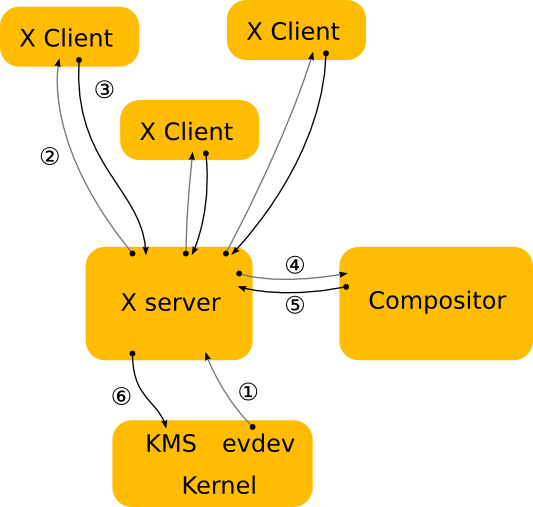

+++
date = '2026-01-11T13:07:25+05:30'
title = 'Is Wayland better than X11'
summary = "Advantages of Wayland over X11"
tags = ["wayland", "x11", "linux", "software", "tech"]
toc = true
showTags = true
draft = false
readTime = true
+++

## Introduction
Wayland and X11 are one of the most prominent display servers. Both of them have their fair share of advantages and disadvantages. While, all the Desktop Environments, Window Managers are switching to Wayland due to it being a better alternative. But what are the differences between these two and why are users and developers switching to Wayland over X11. I'll try my best to give my opinion on both of these display servers.

## What is a Display Server?
In Linux, A display server is a crucial component that acts as a intermediary between graphical applications and the hardware that is responsible for displaying them. It manages the graphical diplay and user input from input devices like keyboard and mouse. 

## X11 Architecture
I'll first talk about the older display server. The X11 project began in 1987 and has the stable support for almost all the linux native software. X11 

