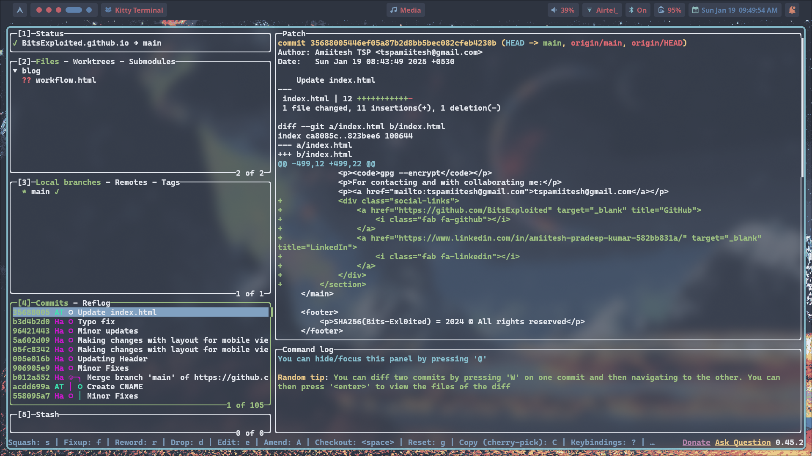

## Introduction

### About Myself

Welcome to this blog, in this blog I'll be discussing about my developer workflow.

I am a college student, currently in my freshman year. I develop many open source projects and through my journey of developing projects, I have tried many tools and software to make my job easier and interesting to work on. In this blog, I will be sharing all the tools and software I use everyday ranging from Desktop to CLI Tools.

## Operating System

This is one of my most favourite part. I have used **Linux** since my childhood, because I was influenced by my dad that I started using Linux as he uses Linux and MacOS most of the time. I am so used to using Linux that is often annoys me when I have to use Windows here at college during labs cause I am more used to coding in terminal and terminal-based editors.

Now, for the part of the operating system, Arch Linux. I used to use Ubuntu and wanted to try out Arch Linux for fun and it turned out that I liked it. Arch Linux is more of a DIY Operating System, it gives up complete freedom over what we want to do right from the time of installation.

It has one of the most powerful package managers, **pacman** and **AUR (Arch User Repository)** package managers like **yay** and **paru**. There is almost every imaginable package or software in the AUR, so much so that anything that does not exist in the AUR can be said "uninvented".

Arch is a very **lightweight distro** and can be very well suitable to be used on old hardware. Almost every desktop environment is stable on Arch and we can choose whatever we find suitable for us.

Another advantage of using Linux is that we can configure almost everything right from the kernel to the visually-pleasing DEs.

## Desktop Environment

For the desktop environment, I use two different desktop environments: **River**.

My primary DE is River, River is not exactly a DE but its called Window Manager, they automatically tile windows when they are created instead of manually adjusting them by ourselves.

Now, I'll explain why and how I use River. I follow certain rules that have become a habit for me over time. I initially got this idea from one of my favorite tech YouTubers, ThePrimeagen, and his way of using window managers.

Window Managers are convenient for people who use keyboard more than the mouse like myself. Everything can be configured with keybinds right from switching panes to switching workspaces. In my config, I have 5 workspaces by default and I could switch them using "SUPER + workspace_number" (SUPER is nothing but the window key).

### So, here's how I use it:

- **Workspace 1:** In the first workspace, I have the **text editor** and the **terminal** I'm working running on a **tmux session**.
- **Workspace 2:** In workspace 2, I have my **browser** open for whenever I encounter issues; I get them fixed with Stack Overflow.
- **Workspace 3:** I usually have my **entertainment setup** here, because when I'm bored I would usually open up a browser, watch YT and get back to what I'm doing. (I don't listen to songs when I'm working).
- **Workspace 4:** I don't usually use 4 and 5 but it depends. But, most of the times its just junk that I have in here.

So, following the above rules over time, they became ingrained in my muscle memory. Now, when I think 'editor,' my fingers instinctively press 'SUPER + 1,' and when I think 'browser,' they press 'SUPER + 2,' and so on for the rest.

## Terminal and Code Editor

This is also one of the most parts of my workflow. I live in the terminal/command line (Shortly as TUI). The only time I use the GUI is for browsing the web, the rest of the time I only spend it in the terminal. So configuring a good terminal and a good terminal-based code editor is one of the most important part for people like me.

- For the terminal emulator, I use **ghostty**.
- For the code editor, I use **Neovim**.

### Ghostty Terminal Emulator

I use the kitty terminal with my minimal configuration like fonts, colorscheme and etc.

For the fonts, I use a global configuration with IosevkaTerm Nerd Font and for the colorscheme I use Gruvbox all over my Linux config.

### Neovim Text Editor

I use **Neovim** as a text editor for all purposes, from **editing LaTeX documents to writing code**. Neovim has a **steep learning curve**, but ultimately it's incredibly useful because I rarely need to take my hands off the keyboard.

## Tools and Software

There are many CLI tools and software that makes my job done easier and faster.

- Git/Github
- LazyGit
- Fish shell
- Tmux
- fzf

### Git/GitHub and LazyGit

One of the most important tool that I use everyday is **Git/GitHub combined with LazyGit**. I don't store my codes or projects locally. Even if the project is uncompleted I store them on GitHub under a public or a private repo. LazyGit makes Git a easy job. Instead of wanting to have type all the commands manually, LazyGit created a TUI (Terminal User Interface) driven by keybinds. It helps view changes, stage them, write commits and push them to remote repo under just keybinds.

This is how LazyGit looks:

As you can see, viewing the changes and commits all under a same place makes us complete our job way faster.

### Tmux Terminal Session and uses

Tmux is another one of such useful tools that I use. Tmux stands for Terminal Multiplexer and is used in Unix-like operating systems. It allows to use multiple terminal sessions in the terminal window. Even if the actual terminal window closes, the tmux session runs in the background and can be accessed with the name of the session, which is helpful when we accidentally close the session without saveing the changes.

Here is how we can use tmux:

<video src="recording.mp4" height="500" width="750" autoplay controls></video>

In the above video, I opened up a tmux session, created three split panes, created a tmux window and then and closed the terminal window and accessed back with the name of the session that I named as "test".

### Fish Shell and fzf fuzzy finder

The standard shell for all the Linux distros is bash. We can choose whatever shell we want after that. The most common choices for shells are bash, zsh and fish. The syntax and structure of fish is way different than what it is in zsh.

Fish is a interactive shell where we can directly interact with the terminal. For example: In bash if we type ls and hit tab it will display the files and directories but we cannot directly interact with the shell to choose, instead we have to look at the file we want and type it and hit tab to complete. Whereas, in fish we can select it directly using the keys.

With the combined use of fzf (a fuzzy finder), we can make fish shell more powerful than what it already is.

## Programming Language

For the part of programming language, I am more into Cybersecurity, Network programming, DevOps and Kernel development. So I work mostly in C, C++, Assembly (for reverse engineering), Python and bash script.

- For Kernel development, I use C programming.
- For embedded systems, I use C and Zig.
- For systems programming, I use C, Zig and C++.

## Bottom Note

These are the tools and software that I use when I develop projects and much more. I uniformly use the Nord colorscheme.

#### Here are the links to everything I use:

- **My Linux Configuration:** [https://github.com/embeddingbits/arch_dotfiles](https://github.com/embeddingbits/arch_dotfiles)
- **Arch Linux:** [https://archlinux.org/](https://archlinux.org/)
- **River DE:** [https://codeberg.org/](https://codeberg.org/river)
- **Ghostty Terminal:** [https://ghostty.org/](https://ghostty.org/)
- **Neovim:** [https://neovim.io/](https://neovim.io/)
- **Custom Neovim Config**: [https://github.com/embeddingbits/arch_dotfiles](https://github.com/embeddingbits/arch_dotfiles)
- **LazyGit:** [https://github.com/jesseduffield/lazygit](https://github.com/jesseduffield/lazygit)
- **Tmux:** [https://github.com/tmux/tmux/wiki](https://github.com/tmux/tmux/wiki)
- **Fish Shell:** [https://fishshell.com/](https://fishshell.com/)

In the upcoming blogs, I'll write on how to configure Tmux for a better work experience.

